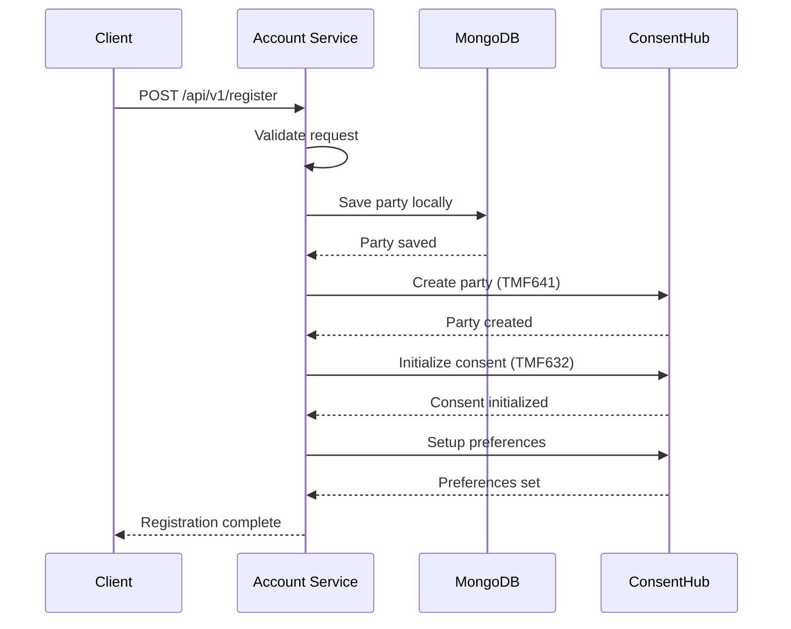

# ConsentHub Integration Guide

This guide explains how to integrate the SLT-Mobitel Account Service with the ConsentHub backend using the new modular service architecture.

## Overview

The integration follows a modular approach where:

1. **Customer registers** via `POST /api/v1/register`
2. **Local save** to MongoDB as a Party
3. **ConsentHub sync** via the modular service:
   - Send party info to ConsentHub (`POST /party` - TMF641)
   - Initialize default consent (`POST /privacyConsent` - TMF632)
   - Setup privacy preferences (`POST /privacyPreference` - Extended TMF632)

## Architecture

```
┌─────────────────┐    ┌──────────────────┐    ┌─────────────────┐
│   Frontend      │    │  Account Service │    │  ConsentHub     │
│  Registration   │───▶│  (Local MongoDB) │───▶│   Backend       │
└─────────────────┘    └──────────────────┘    └─────────────────┘
                              │
                              ▼
                       ┌──────────────────┐
                       │ ConsentHub       │
                       │ Service Module   │
                       └──────────────────┘
```

## Files Structure

```
account-service/
├── controllers/
│   └── register.controller.js     # Updated with modular integration
├── services/
│   └── consentHub.service.js      # NEW: Modular ConsentHub service
├── models/
│   └── Party.js                   # Existing Party model
├── .env                           # Updated environment config
├── .env.consenthub.example        # NEW: Configuration template
└── test-consenthub-service.js     # NEW: Service testing utility
```

## Environment Configuration

### Required Variables

Add these to your `.env` file:

```env
# ConsentHub API Configuration (REQUIRED)
CONSENTHUB_API=https://consenthub-backend.onrender.com/api/v1
INTERNAL_API_KEY=your-secure-api-key
```

### Complete Configuration

See `.env.consenthub.example` for all available configuration options.

## Service Usage

### Option 1: Individual Functions

```javascript
const { createParty, initConsent, initPreference } = require('../services/consentHub.service');

// In your controller
const partyPayload = {
  partyId,
  name,
  email,
  mobile,
  language,
  type: 'individual'
};

await createParty(partyPayload);
await initConsent(partyId);
await initPreference(partyId);
```

### Option 2: Complete Integration (Recommended)

```javascript
const { completeIntegration } = require('../services/consentHub.service');

// Complete integration with error handling
const result = await completeIntegration(partyPayload, consentOptions, preferenceOptions);

if (result.success) {
  console.log('Integration successful');
  if (result.hasErrors) {
    console.warn('Some steps failed:', result.results.errors);
  }
} else {
  console.error('Critical error:', result.error);
}
```

## API Integration Details

### 1. Party Creation (TMF641)

**Endpoint**: `POST /tmf-api/party/v5/individual`

**Payload**:
```json
{
  "partyId": "uuid-v4",
  "name": "Customer Name",
  "email": "customer@example.com",
  "mobile": "+94771234567",
  "language": "en",
  "type": "individual",
  "dateOfBirth": "1990-01-01",
  "status": "active"
}
```

### 2. Consent Initialization (TMF632)

**Endpoint**: `POST /api/v1/privacyConsent`

**Payload**:
```json
{
  "id": "consent-uuid",
  "partyId": "party-uuid",
  "purpose": "marketing",
  "status": "pending",
  "channel": "email",
  "consentType": "explicit",
  "validFor": {
    "startDateTime": "2024-01-01T00:00:00Z"
  }
}
```

### 3. Preference Initialization (Extended TMF632)

**Endpoint**: `POST /api/v1/privacyPreference`

**Payload**:
```json
{
  "id": "preference-uuid",
  "partyId": "party-uuid",
  "preferredChannels": {
    "email": true,
    "sms": true,
    "push": false
  },
  "topicSubscriptions": {
    "promotions": false,
    "billing": true,
    "security": true
  },
  "doNotDisturb": {
    "enabled": true,
    "start": "21:00",
    "end": "07:00",
    "timezone": "Asia/Colombo"
  }
}
```

## Error Handling

The service implements graceful error handling:

1. **Critical Errors**: Party creation failures will stop the process
2. **Non-Critical Errors**: Consent/Preference failures won't stop registration
3. **Rollback Strategy**: Local registration persists even if ConsentHub sync fails
4. **Logging**: Comprehensive logging for debugging and monitoring

## Testing

### Run Service Tests

```bash
node test-consenthub-service.js
```

### Test Individual Functions

```javascript
const { testIndividualFunctions } = require('./test-consenthub-service');
await testIndividualFunctions();
```

### Test Complete Integration

```javascript
const { testCompleteIntegration } = require('./test-consenthub-service');
await testCompleteIntegration();
```

## Registration Flow



## Response Format

### Success Response

```json
{
  "message": "Customer registered successfully",
  "data": {
    "partyId": "uuid-v4",
    "name": "Customer Name",
    "email": "customer@example.com",
    "mobile": "+94771234567",
    "language": "en",
    "createdAt": "2024-01-01T00:00:00Z"
  },
  "consentHubIntegration": {
    "success": true,
    "hasErrors": false
  }
}
```

### Partial Success Response

```json
{
  "message": "Customer registered successfully",
  "data": { /* ... */ },
  "consentHubIntegration": {
    "success": true,
    "hasErrors": true,
    "warnings": [
      {
        "step": "consent",
        "error": "Consent initialization failed: timeout"
      }
    ]
  }
}
```

## Security Headers

All ConsentHub API calls include:

```javascript
headers: {
  'x-api-key': process.env.INTERNAL_API_KEY,
  'Content-Type': 'application/json',
  'User-Agent': 'SLT-Mobitel-Account-Service/1.0.0'
}
```

## Monitoring and Logging

The service provides comprehensive logging:

- `[ConsentHubService]`: Service-level operations
- `[RegisterController]`: Controller-level operations
- Each step is logged with success/failure status
- Errors include detailed messages for debugging

## Health Check

Test ConsentHub availability:

```javascript
const { healthCheck } = require('./services/consentHub.service');
const isHealthy = await healthCheck();
```

## Production Considerations

1. **API Key Security**: Use strong, secure API keys
2. **Timeout Configuration**: Adjust timeouts based on network conditions
3. **Error Monitoring**: Implement monitoring for failed integrations
4. **Retry Logic**: Consider implementing retry logic for failed calls
5. **Rate Limiting**: Respect ConsentHub API rate limits

## Troubleshooting

### Common Issues

1. **Configuration Missing**: Check `CONSENTHUB_API` and `INTERNAL_API_KEY`
2. **Network Timeouts**: Increase timeout values or check connectivity
3. **Authentication Errors**: Verify API key validity
4. **Data Validation**: Ensure payload matches expected format

### Debug Logging

Enable debug logging:

```env
DEBUG_CONSENTHUB=true
LOG_LEVEL=debug
```

This will provide detailed request/response logging for troubleshooting.
